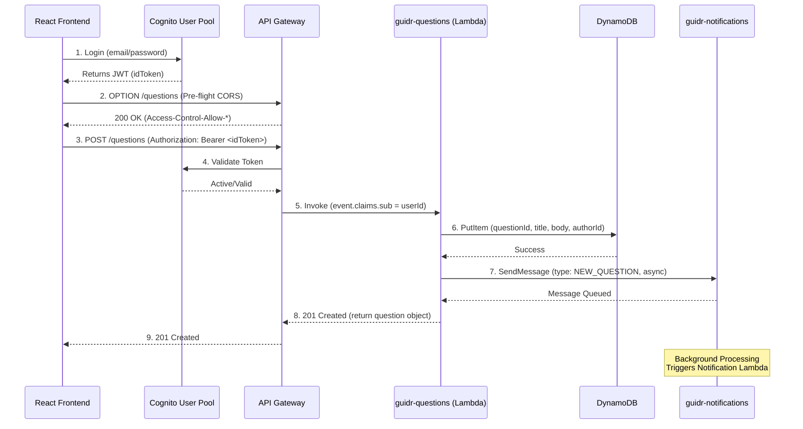

# Guidr 🎓

> A cloud-native career mentorship platform connecting college students with verified professionals.

[](https://aws.amazon.com)
[](https://react.dev)
[](https://aws.amazon.com/lambda)
[](https://aws.amazon.com/dynamodb)

---

## 🏗 System Architecture & Cloud Infrastructure

Guidr relies entirely on a modern, Serverless Microservices architecture hosted on AWS, optimized for the **AWS Free Tier**.

```mermaid
graph TD
    Client[Browser Student/Pro]
    
    %% Distribution
    subgraph Edge
        CDN[CloudFront CDN]
        CF_S3[(S3 Static Bucket)]
    end
    
    %% API
    subgraph API Routing
        API[API Gateway]
        Auth[Cognito Authorizer]
        CORS[OPTIONS Preflight Handler]
    end
    
    %% Auth Services
    subgraph Identity
        UserPool[Cognito User Pool]
    end

    %% Microservices
    subgraph Microservices Layer
        L_Auth(guidr-auth)
        L_Users(guidr-users)
        L_Questions(guidr-questions)
        L_Answers(guidr-answers)
        L_Notif(guidr-notification)
    end

    %% Storage
    subgraph Database Layer
        DB_Users[(guidr-users table)]
        DB_Questions[(guidr-questions table)]
        DB_Answers[(guidr-answers table)]
    end

    %% Event Bus
    subgraph Messaging
        Q[SQS Notification Queue]
        Topic((SNS Topic))
    end

    %% Connections
    Client -.->|Log in / Sign up| UserPool
    Client -->|Loads React SPA| CDN
    CDN --> CF_S3
    
    Client -->|REST API Calls| API
    API <-->|Validates JWT| Auth
    Auth <--> UserPool
    API <--> CORS
    
    API -->|GET /auth/me| L_Auth
    API -->|GET, PUT /users| L_Users
    API -->|GET, POST /questions| L_Questions
    API -->|GET, POST, PUT /answers| L_Answers

    L_Auth <--> DB_Users
    L_Users <--> DB_Users
    L_Questions <--> DB_Questions
    L_Answers <--> DB_Answers
    L_Answers <--> DB_Questions
    
    L_Questions -->|Async Event| Q
    L_Answers -->|Async Event| Q
    
    Q -->|Triggers| L_Notif
    L_Notif -->|Fan-out| Topic
    Topic -.->|Emails| Client

    %% Observability
    subgraph Observability
        XR[AWS X-Ray Tracing]
        RUM[CloudWatch RUM]
        CW[CloudWatch Dashboards]
    end

    Client -.->|Telemetry| RUM
    MicroservicesLayer -.->|Traces| XR
    API Routing -.->|Traces| XR
```

---

## 🔄 Core Data Flow Diagram (DFD)

The following sequence illustrates how the primary action (Posting a Question) flows through the Guidr architecture.



---

## 📁 Project Structure

```text
Guidr/
├── frontend/           # React SPA (Hosted on S3 + CloudFront)
│   ├── src/api/        # Axios clients passing Cognito tokens
│   ├── src/pages/      # View layouts (QAFeed, Profile, Dashboard)
│   └── src/context/    # Global Auth State
├── backend/
│   └── lambdas/        # Node.js Serverless Microservices
│       ├── answers-service/ 
│       ├── questions-service/
│       ├── users-service/
│       ├── auth-service/     # Handles Post-Confirmation hooks
│       └── notification-worker/
└── deployment/         # Automation shell scripts
```

## ⚡ Complete API Definitions

All live routes deployed on `us-east-1` AWS Gateway `ms3stxtwuf`.

| Method | Route | Auth Required | Backend Target | Description |
|---|---|---|---|---|
| `POST` | `/auth` | No | `guidr-auth` | Initial Profile Setup Hook |
| `GET` | `/auth/me` | Yes (Cognito) | `guidr-auth` | Returns Current Profile |
| `GET` | `/users` | Yes (Cognito) | `guidr-users` | Search professionals via query |
| `GET` | `/users/{id}` | No | `guidr-users` | Get public profile |
| `PUT` | `/users/{id}` | Yes (Cognito) | `guidr-users` | Edit profile |
| `GET` | `/questions` | No | `guidr-questions` | List / QA Feed |
| `POST`| `/questions` | Yes (Cognito) | `guidr-questions` | Ask a question |
| `GET` | `/questions/{id}` | No | `guidr-questions` | View single question |
| `GET` | `/answers?questionId` | No | `guidr-answers` | List answers for question |
| `POST`| `/answers` | Yes (Cognito) | `guidr-answers` | Post an answer |
| `PUT` | `/answers/{id}/upvote` | Yes (Cognito) | `guidr-answers` | Upvote an answer |

_(All routes implement CORS `OPTIONS` handlers allowing wildcard Origins for robust cross-origin access)._

---

## 👤 User Roles

- **Student** — Ask questions, browse professionals, get mentorship.
- **Professional** — Answer questions, share expertise, build reputation. (Automatically assigned upon signup).

## 🚀 Live Environment details

Currently deployed in a production-ready state:
- **CDN**: CloudFront `https://d3k03ku5qbyly4.cloudfront.net`
- **Observability**: CloudWatch RUM & X-Ray (Active)
- **Config**: SSM Parameter Store (Managed)
- **Region**: `us-east-1` (N. Virginia)
- **Account**: `535002889870`
