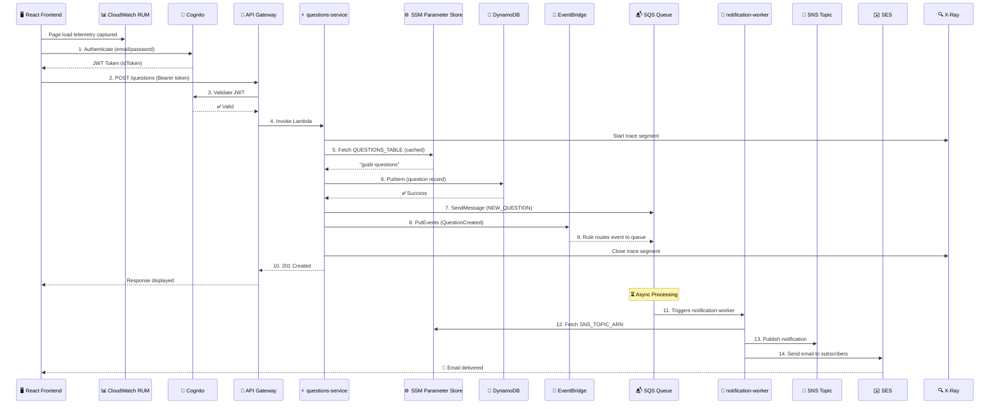
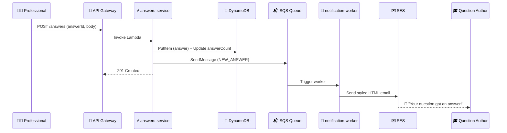
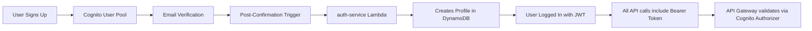
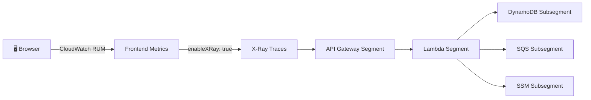
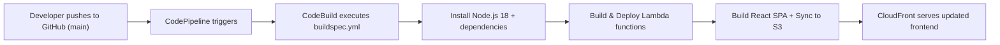

# Guidr 🎓

> A cloud-native career mentorship platform connecting college students with verified professionals — built entirely on **AWS Serverless** with **15+ managed services**, event-driven architecture, distributed tracing, and AI-powered content moderation.

[](https://aws.amazon.com)
[](https://react.dev)
[](https://aws.amazon.com/lambda)
[](https://aws.amazon.com/dynamodb)
[](https://aws.amazon.com/xray)
[](https://www.docker.com)
[-green)](https://aws.amazon.com/cdk)

---

## 📌 Project Focus

> **Note**: This project's primary focus is on **AWS cloud architecture, infrastructure design, and DevOps practices**. The frontend serves as a functional interface to demonstrate the backend capabilities. Further frontend enhancements to match the complete product vision are planned as a future iteration.

---

## 🏗 System Architecture

Guidr is built on a **100% Serverless Microservices Architecture** using AWS, optimized to operate at **$0 monthly cost** within the AWS Free Tier. The platform leverages 15+ AWS services across compute, storage, messaging, observability, security, and CI/CD layers.

### High-Level Architecture Diagram

```mermaid
graph TD
    Client["🖥️ Browser (Student / Professional)"]

    %% ── CDN & Static Hosting ──
    subgraph Edge["🌐 Content Delivery"]
        CDN["CloudFront CDN"]
        S3_FE[("S3 Static Bucket")]
    end

    %% ── API Layer ──
    subgraph APILayer["🔀 API Layer"]
        APIGW["API Gateway (REST)"]
        CogAuth["Cognito Authorizer"]
        CORS["OPTIONS Preflight"]
    end

    %% ── Identity ──
    subgraph Identity["🔐 Identity & Access"]
        UserPool["Cognito User Pool"]
        IAM["IAM Roles & Policies"]
    end

    %% ── Compute: Microservices ──
    subgraph Compute["⚡ Compute Layer — Lambda Microservices"]
        L_Auth("guidr-auth-service")
        L_Users("guidr-users-service")
        L_Questions("guidr-questions-service")
        L_Answers("guidr-answers-service")
        L_Notif("guidr-notification-worker")
    end

    %% ── Storage ──
    subgraph Storage["💾 Database Layer — DynamoDB"]
        DB_Users[("guidr-users")]
        DB_Questions[("guidr-questions")]
        DB_Answers[("guidr-answers")]
    end

    %% ── Messaging ──
    subgraph Messaging["📨 Event-Driven Messaging"]
        EventBus["EventBridge Bus"]
        SQS["SQS Notification Queue"]
        SNS(("SNS Topic"))
        SES["SES Email Delivery"]
    end

    %% ── Observability ──
    subgraph Observability["📊 Observability & Monitoring"]
        XRay["AWS X-Ray"]
        RUM["CloudWatch RUM"]
        CWDash["CloudWatch Dashboards"]
        CWLogs["CloudWatch Logs"]
    end

    %% ── Configuration ──
    subgraph Config["⚙️ Configuration Management"]
        SSM["SSM Parameter Store"]
        Budgets["AWS Budgets"]
    end

    %% ── AI ──
    subgraph AI["🤖 AI / ML"]
        Rekog["Amazon Rekognition"]
    end

    %% ── DevOps ──
    subgraph DevOps["🔄 CI/CD Pipeline"]
        CP["CodePipeline"]
        CB["CodeBuild"]
        GH["GitHub (Source)"]
    end

    %% ── IaC ──
    subgraph IaC["🏗️ Infrastructure as Code"]
        CDK["AWS CDK (Java)"]
        Docker["Docker Containers"]
    end

    %% ── Connections ──
    Client -->|"Loads React SPA"| CDN
    CDN --> S3_FE
    Client -.->|"Login / Signup"| UserPool
    Client -->|"REST API Calls"| APIGW
    APIGW <-->|"Validates JWT"| CogAuth
    CogAuth <--> UserPool
    APIGW <--> CORS

    APIGW -->|"GET, POST /auth"| L_Auth
    APIGW -->|"GET, PUT /users"| L_Users
    APIGW -->|"GET, POST /questions"| L_Questions
    APIGW -->|"GET, POST, PUT /answers"| L_Answers

    L_Auth <--> DB_Users
    L_Users <--> DB_Users
    L_Questions <--> DB_Questions
    L_Answers <--> DB_Answers
    L_Answers <--> DB_Questions

    L_Questions -->|"Publishes Event"| EventBus
    L_Questions -->|"Async Message"| SQS
    L_Answers -->|"Async Message"| SQS
    EventBus -->|"Routes to"| SQS

    SQS -->|"Triggers"| L_Notif
    L_Notif -->|"Fan-out"| SNS
    L_Notif -->|"Direct Email"| SES
    SNS -.->|"Notifications"| Client

    L_Users -.->|"AI Moderation"| Rekog

    Compute -.->|"Traces"| XRay
    Client -.->|"Telemetry"| RUM
    Compute -.->|"Logs"| CWLogs
    Compute -.->|"Fetches Config"| SSM

    GH -->|"Push to main"| CP
    CP --> CB
    CB -->|"Deploys"| Compute
    CB -->|"Deploys"| S3_FE

    CDK -.->|"Provisions"| Compute
    Docker -.->|"Packages"| L_Questions
```



---

## 🔄 Core Data Flow: "Post a Question" (End-to-End)

This sequence diagram illustrates how a single user action flows through the entire platform — from the browser, through 7 AWS services, all the way to an email notification.



---

## 🔄 Notification Flow: "Answer Posted" (Event-Driven)



---

## ☁️ AWS Services Used (15+ Services)

| Category | Service | Purpose | Free Tier |
|---|---|---|---|
| **Compute** | AWS Lambda | 5 microservices (Node.js 18) | 1M requests/month |
| **API** | API Gateway (REST) | Request routing + CORS + JWT auth | 1M calls/month |
| **Database** | DynamoDB | 3 tables (Users, Questions, Answers) | 25GB + 25 WCU/RCU |
| **Auth** | Cognito User Pool | Email/password authentication + JWT | 50K MAU |
| **CDN** | CloudFront | Global SPA distribution | 1TB transfer/month |
| **Storage** | S3 | Frontend static hosting | 5GB |
| **Messaging** | SQS | Async notification queue | 1M requests/month |
| **Messaging** | SNS | Fan-out notification delivery | 1M publishes/month |
| **Email** | SES | Transactional email delivery | 3K/month |
| **Events** | EventBridge | Event-driven service decoupling | 1M events/month |
| **AI/ML** | Rekognition | Profile image content moderation | 5K images/month |
| **Tracing** | X-Ray | Distributed tracing across services | 100K traces/month |
| **Monitoring** | CloudWatch RUM | Real user frontend performance | Free Tier |
| **Monitoring** | CloudWatch Dashboards | System health visualization | 3 dashboards free |
| **Config** | SSM Parameter Store | Dynamic runtime configuration | Free (Standard) |
| **Cost** | AWS Budgets | Spending alerts ($1 threshold) | 2 budgets free |
| **CI/CD** | CodePipeline + CodeBuild | Automated deployment on push | 1 pipeline free |
| **IaC** | AWS CDK (Java) | Infrastructure as Code | Free (tooling) |
| **Container** | Docker | Lambda container packaging | Free (local) |

---

## 📁 Project Structure

```text
Guidr/
├── frontend/                          # React SPA (Vite + React Router)
│   ├── src/
│   │   ├── api/                       # Axios HTTP clients with Cognito tokens
│   │   ├── components/                # Reusable UI components
│   │   ├── context/AuthContext.jsx     # Global authentication state
│   │   ├── pages/                     # Route-level page layouts
│   │   ├── main.jsx                   # Entry point + CloudWatch RUM integration
│   │   └── App.jsx                    # React Router configuration
│   └── package.json
│
├── backend/
│   └── lambdas/                       # Node.js 18 Serverless Microservices
│       ├── auth-service/              # Cognito Post-Confirmation + GET /auth/me
│       ├── users-service/             # User profiles + Rekognition AI moderation
│       ├── questions-service/         # Q&A CRUD + EventBridge + SQS publishing
│       │   └── Dockerfile             # Container image for Lambda deployment
│       ├── answers-service/           # Answer CRUD + SQS notifications
│       └── notification-worker/       # SQS → SNS → SES email pipeline
│
├── guidr-infra-cdk/                   # AWS CDK (Java) — Infrastructure as Code
│   ├── src/main/java/com/myorg/
│   │   ├── GuidrInfraCdkApp.java      # CDK application entry point
│   │   └── GuidrInfraCdkStack.java    # Stack: EventBridge + Docker Lambda + IAM
│   └── pom.xml                        # Maven dependencies
│
├── deployment/                        # Automation scripts
│   ├── deploy-lambdas.sh              # Packages and deploys all 5 Lambda functions
│   ├── deploy-frontend.sh             # Builds React app and syncs to S3 + CloudFront
│   ├── setup-aws.sh                   # Initial AWS infrastructure provisioning
│   └── update-lambdas-code.sh         # Quick code-only Lambda updates
│
├── infrastructure/
│   └── dynamodb-tables.json           # DynamoDB table definitions
│
├── buildspec.yml                      # AWS CodeBuild CI/CD specification
└── README.md
```

---

## ⚡ Complete API Reference

All routes deployed on AWS API Gateway in `us-east-1` region.

| Method | Route | Auth | Lambda Target | Description |
|---|---|---|---|---|
| `POST` | `/auth` | No | `guidr-auth-service` | Post-Confirmation profile creation |
| `GET` | `/auth/me` | ✅ Cognito JWT | `guidr-auth-service` | Get current user profile |
| `GET` | `/users` | ✅ Cognito JWT | `guidr-users-service` | Search/list professionals |
| `GET` | `/users/{id}` | No | `guidr-users-service` | Get public profile |
| `PUT` | `/users/{id}` | ✅ Cognito JWT | `guidr-users-service` | Update own profile |
| `GET` | `/questions` | No | `guidr-questions-service` | List all questions (with filters) |
| `POST` | `/questions` | ✅ Cognito JWT | `guidr-questions-service` | Post a new question |
| `GET` | `/questions/{id}` | No | `guidr-questions-service` | View single question |
| `GET` | `/answers?questionId=` | No | `guidr-answers-service` | List answers for a question |
| `POST` | `/answers` | ✅ Cognito JWT | `guidr-answers-service` | Post an answer |
| `PUT` | `/answers/{id}/upvote` | ✅ Cognito JWT | `guidr-answers-service` | Upvote an answer |

> All routes include CORS `OPTIONS` preflight handlers for cross-origin browser requests.

---

## 🔐 Authentication Flow



---

## 📊 Observability Stack

### End-to-End Tracing (Frontend → Backend)



| Layer | Tool | What It Tracks |
|---|---|---|
| **Frontend** | CloudWatch RUM | Page load times, JS errors, user sessions, Core Web Vitals |
| **API** | X-Ray + API Gateway | Request latency, error rates, throttling |
| **Backend** | X-Ray + Lambda | Cold starts, execution duration, downstream calls |
| **Database** | X-Ray + DynamoDB | Read/write latency per table |
| **Dashboard** | CloudWatch | Aggregated error rates, traffic volume, p90 latency |

---

## 🔄 CI/CD Pipeline



---

## 👤 User Roles

| Role | Capabilities |
|---|---|
| **Student** | Ask questions, browse professionals, upvote answers, receive email notifications |
| **Professional** | Answer questions, share expertise, build reputation, receive new question alerts |

---

## 🚀 Live Environment

| Resource | Details |
|---|---|
| **Frontend CDN** | `https://d3k03ku5qbyly4.cloudfront.net` |
| **Region** | `us-east-1` (N. Virginia) |
| **Observability** | CloudWatch RUM + X-Ray (Active Tracing) |
| **Configuration** | SSM Parameter Store (Dynamic) |
| **Event Bus** | EventBridge (`guidr-event-bus`) |
| **Cost** | **$0.00/month** (AWS Free Tier optimized) |
| **Budget Alert** | Email notification at 80% of $1.00 threshold |
| **CI/CD** | CodePipeline → CodeBuild (auto-deploy on push) |

---

## 🛠️ Local Development

```bash
# 1. Clone the repository
git clone https://github.com/Aadi1903/Guidr.git && cd Guidr

# 2. Install frontend dependencies
cd frontend && npm install

# 3. Set up environment variables
cp .env.example .env   # Add your Cognito and API Gateway values

# 4. Start the dev server
npm run dev

# 5. Deploy to AWS (requires AWS CLI configured)
cd .. && ./deployment/deploy-lambdas.sh && ./deployment/deploy-frontend.sh
```

---

## 📄 License

This project is built for educational and portfolio purposes.
